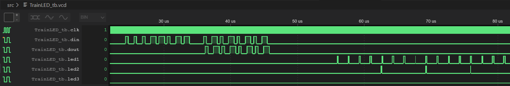

 

# TrainLED2 - A RGB-LED driver for TinyTapeout3p5

A RGB-LED driver using the WS2812 protocol

A fully digital implementation of an RGB LED driver that accepts the WS2812 for data input. The design is fully clocked, so the timing parameters of the protocol depend on the clock rate. A pulse between 1 and 5 clock cycles on the input will be interpreted as a zero, longer pulses as a one. Each driver accepts 3x8=24 bit of input data to set the brightness of LED1,LED2 and LED3 (R,G,B). After 24 bit have been received, additional input bits are re-timed and forwarded to the data output.

After the data input was idle for 96 clock cycles, the input data is latched into the PWM engine and the data input is ready for the next data frame.

The PWM engine uses a special dithering scheme to allow flicker free LED dimming even for relatively low clock rates.  

Source and testbench can be found in the [/src](/src) folder. Execute the shell script 'run.sh' to invoke the testbench.

## Output of testbench

